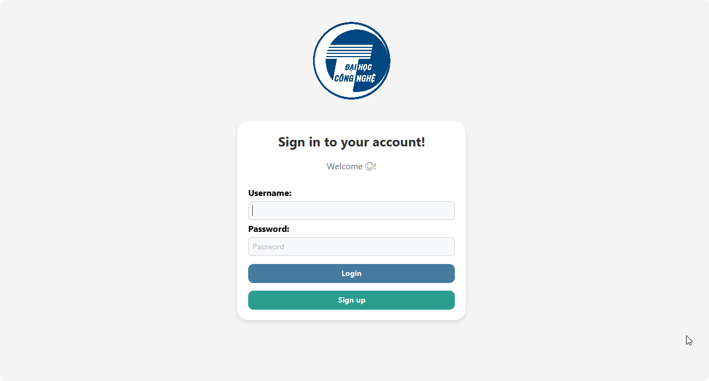
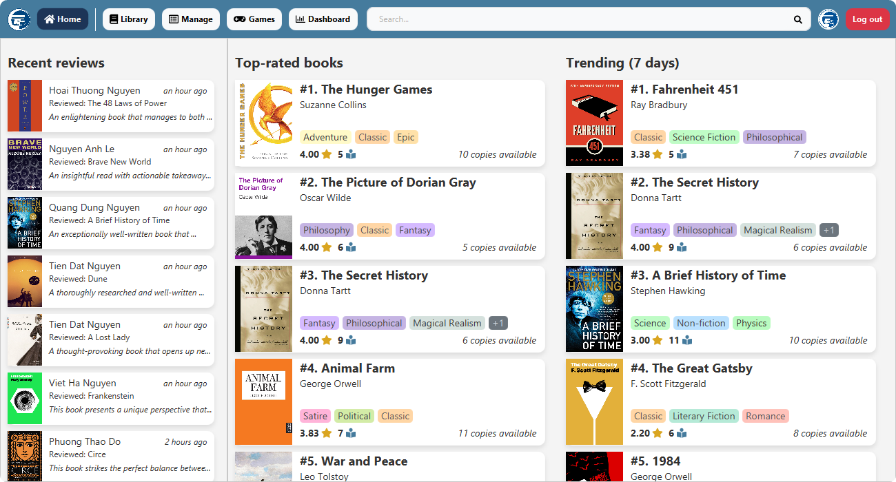
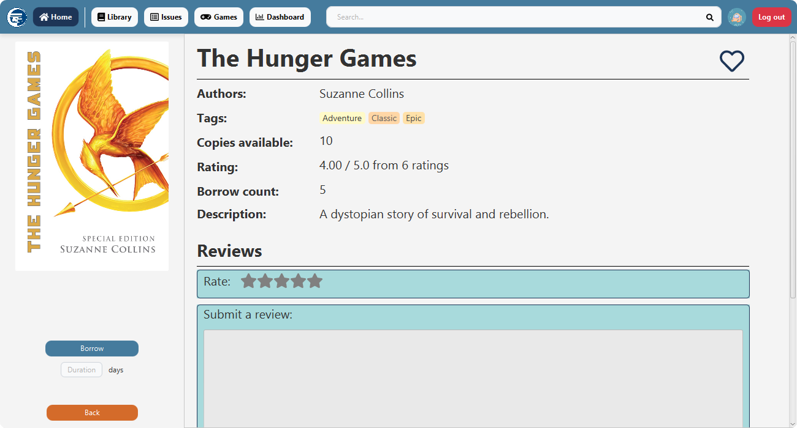
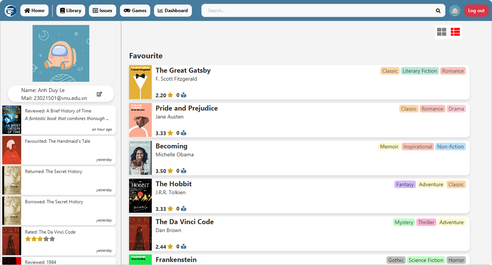
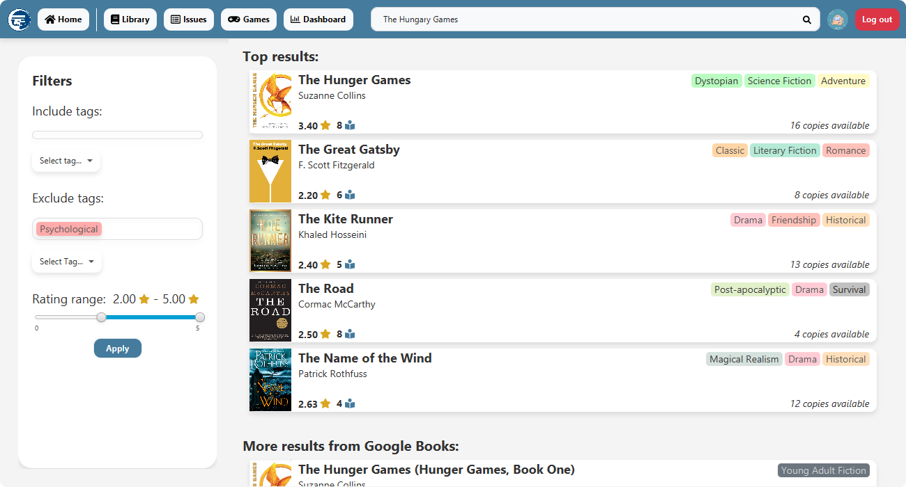
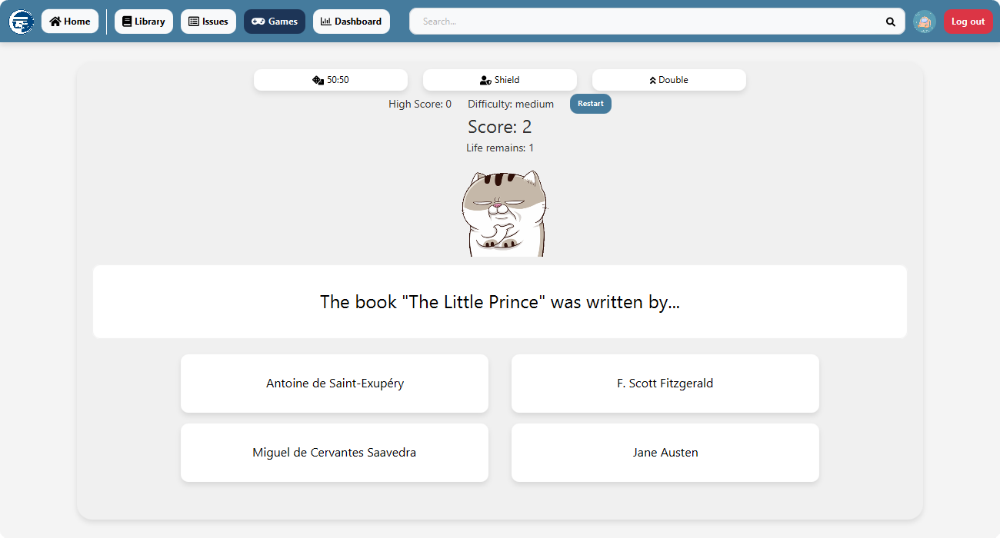
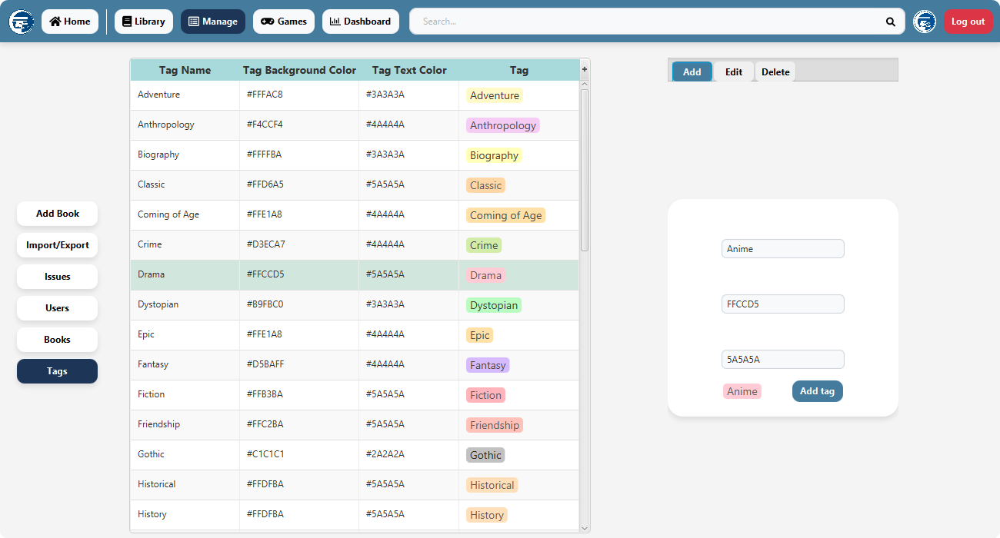
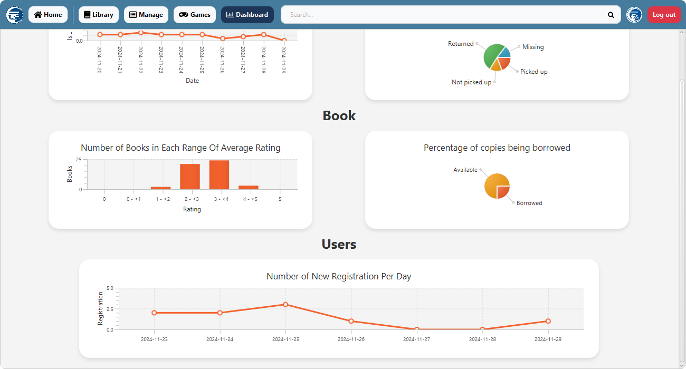

<div align="center">

# Proview

Proview is a state-of-the-art **library management system**. It simplifies library operations for librarians and enhances the user experience with easy book searches, reservations, and personalized profiles.
</div>

<a name="readme-top"></a>

## 🫂 Goals & Contributors

- This project was made for an assignment for an object-oriented programming course (INT2204 17) at [UET - VNU][uet_url]. We are a group of 3 aspiring and passionate members:
  - Le Anh Duy (ID: 23021501)
  - Nguyen Quang Dung (ID: 23021497)
  - Nguyen Tien Dat (ID: 23021521)

## ✨ Features
Proview is designed with user experience at its core, offering a comprehensive and delightful platform for book lovers and administrators:

### 🔒 Seamless Authentication
- Effortlessly create an account and log in with our user-friendly system.
  

### 🏠 Clean and Modern Home Page
- Explore top-rated and trending books.
  

### 📖 Rich Book Information
- Dive deep into detailed book info pages featuring ratings and reviews from other readers.
  

### 👤 Customizable User Profiles
- Track your books with your very own customizable profile and activity log.
  

### 🔍 Advanced Search Functionality
- Experience powerful search capabilities that explore both Proview’s library and Google Books data. Search filters are here to help you find exactly what you're looking for.
  

### 🎮 Built-in Game
- Who doesn’t love a little fun? Play our exciting trivia game to unwind after a reading session.
  

### 🛠️ Robust Admin Management
- For librarians, Proview provides a powerful, all-in-one management system to oversee users, books, and other data effortlessly.
  

### 📊 Dynamic Data Dashboard
- Visualize key insights with a sleek dashboard.
  

<div align="right">

[&nwarr; Back to top](#readme-top)

</div>

## ⚡️ Quick start
- Proview uses Java and JavaFX as its framework. Make sure you have installed Java (21+) on your device.
- Open your favourite console, head to your desired directory and clone the project.
    ```console
    git clone https://github.com/HmmOrange/proview
    ```
- Next, load the Maven project and download necessary dependencies, all of which are listed in the [pom.xml](./pom.xml) file.
- You will then need to add a `.env` file in the root of your project. This file contains details for a connection to a MySQL database (if you don't have MySQL installed yet, go ahead and do so).
    ```env
    SQL_USER= 
    SQL_PASSWORD= 
    SQL_DB_URL= 
    RUN_DB_DATA_INIT= 
    RUN_DB_QUESTIONS_INIT= 
    ```

  - `SQL_USER`: User of the data source.
  - `SQL_PASSWORD`: Password to access the data source.
  - `SQL_DB_URL`: URL to the schema in your data source. It should start with `jdbc:mysql://`.
  - `RUN_DB_DATA_INIT`: If `True`, this will create tables in MySQL and initialize sample data for Proview.
  - `RUN_DB_QUESTIONS_INIT`: If `True`, this will download questions for the trivia game.

> [!IMPORTANT]
> You must set both `RUN_DB_DATA_INIT` and `RUN_DB_QUESTIONS_INIT` to `True` if you are running it for the first time. Afterwards, you may set them to something else.

<div align="right">

[&nwarr; Back to top](#readme-top)

</div>

## ⚠️ License

[`The Proview project`][repo_url] is free and open-source, licensed under the [MIT License][repo_license_url], created and supported with 🩵 for UI & UX. Icon assets used in the project are sourced from [ikonli][ikonli_repo_url]'s [FontAwesome][fa_url] pack.

<!-- Repository links -->
[repo_url]: https://github.com/HmmOrange/proview
[ikonli_repo_url]: https://github.com/kordamp/ikonli
[uet_url]: https://uet.vnu.edu.vn/
[fa_url]: https://fontawesome.com/
